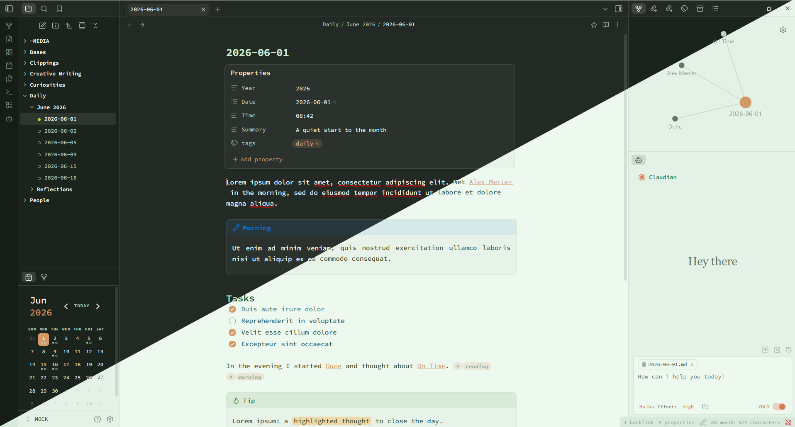

# Paper Source

> A standalone [Obsidian](https://obsidian.md) theme with a soft mint-paper typewriter look and warm organic green / orange accents.

Paper Source pairs **Source Code Pro** monospace typography with a calm, paper-like surface and a color-coded green heading ladder. Bold and italic text glow in warm orange, backlinks are underlined in tan, and the dark mode leans on Monokai-inspired surfaces with crisp mint text.

---

## Features

- **Typewriter typography** — Source Code Pro everywhere (editor, interface, and code) for a clean monospace feel, with a comfortable 16px base and 1.6 line height.
- **Color-coded heading ladder** — `h1`–`h6` step through an organic green gradient so document structure reads at a glance.
- **Warm accent system** — bold and italic text in warm orange, tan-underlined backlinks, and coral interactive accents.
- **Justified reading view** — body text is justified with automatic hyphenation and a comfortable `72ch` measure.
- **Light & dark modes** — a mint-paper light theme and a deep, Monokai-inspired dark theme (the active-file dot turns Monokai green in the dark).
- **Refined chrome** — rounded radii, dot-marker file tree, pill-shaped tags, custom scrollbars, and subtle motion throughout.

## Palette

| Role | Light | Dark |
| --- | --- | --- |
| Background | `#eef8f0` | `#272822` |
| Text | `#37553a` | `#eef8f0` |
| Accent (backlink) | `#d39a67` | `#d39a67` |
| Bold / italic | `#c86f2b` | `#d39a67` |
| Heading top (`h1`) | `#143d22` | `#d0eed4` |

## Installation

### Manual

1. Download `theme.css` and `manifest.json` from this repository.
2. Copy them into your vault at `.obsidian/themes/Paper Source/`.
3. In Obsidian, go to **Settings → Appearance → Themes** and select **Paper Source**.

Toggle between light and dark in **Settings → Appearance → Base color scheme**.

## Compatibility

- Requires Obsidian **1.0.0** or newer.
- The Source Code Pro font is loaded from Google Fonts; if you work offline, install the font locally for the full effect.

## License

[MIT](LICENSE) © 2026 Šimon Zelenka
